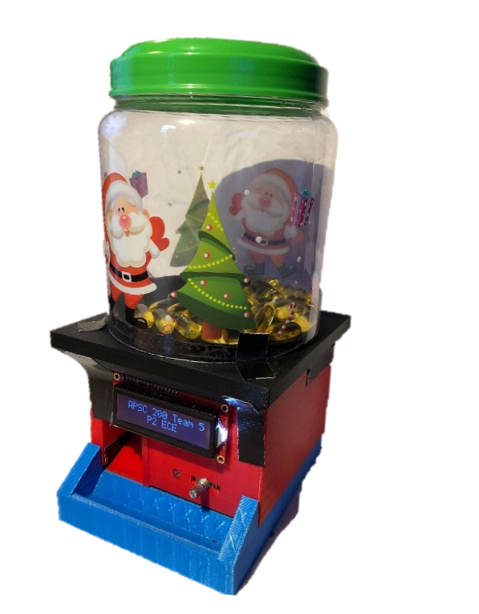

# Pill Dispenser
This project is a 3D printed pill-dispenser connected to a cross-platform app to control the schedule for dispensing pills.
The purpose of the project was a proof of concept pill dispenser to be used in nursing homes.

## Getting Started
### iOS Application
- Coming Soon!

## Prototype
The physical image of the prototype can be seen below

## Authors
- Brent Champion
- Rayad Faed
- Ricardo He
- Daniel Tavernese

## Usage
All code that has been provided is as-is. The authors are not responsible for any actions or consequences associated with the use, distribution and/or modification of these files. This project is for personal, educational use only. By using any code contained in these files, you agree to these terms and will not hold the authors responsible for any actions.

This project is licensed under the MIT License - see the [LICENSE](https://github.com/bchampp/pill-dispenser/blob/master/LICENSE) file for details
